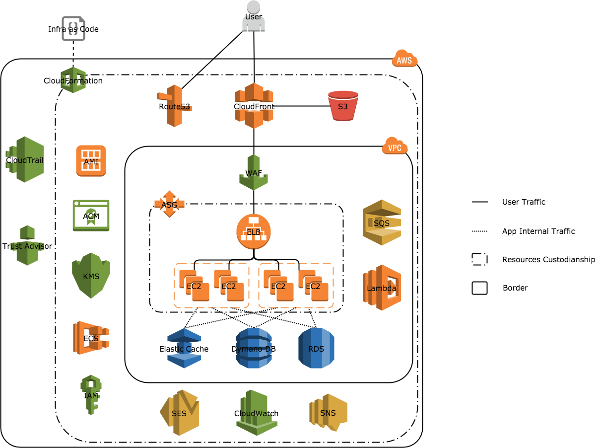

# 说明

### 基础服务

只要使用了AWS，有一些基础服务是必须使用的，比如：

**IAM**：用户和权限管理

**VPC/Subnet**：网络管理

**Security Group/NACL**： 安全策略控制

**AMI**：虚拟机镜像

还有一些AWS默认提供了，有些人可能没有关注到但是却非常有用和重要的服务

**CloudTrail**：AWS服务调用记录，安全审计使用

**Trust Advisor**：AWS服务及安全改进优化建议，可以查看利用率较低的资源，安全防护不到位的服务配置等

**CloudWatch**：数据收集，日志收集，事件处理和调度

### 常用服务

这些基本上是AWS最成功的，绝大部分人都会使用的服务，不做过多介绍

**EC2(EBS/Snapshot)**：虚拟机相关

**RDS(Dynamo DB/Elastic Cache)**：数据库和Cache相关

**S3(Glacier/EFS)**：存储相关

还有另外一些常用服务，但不是所有人都会用：

**Route53**：DNS服务

**ELB**：Elastic LoadBlancer 负载均衡

**ASG**：Auto Scaling Group 自动伸缩

**CloudFront**：CDN服务

### 辅助服务

这些辅助服务极大的提高了AWS服务生态圈的完整性，但是很多人并没有了解和使用，这些服务会极大的提高业务的可持续性，安全性以及做到基础架构即代码的自动化部署实践。

**SES**：邮件服务

**SQS**：队列服务

**SNS**：消息通知/订阅服务

**Lambda**：Funcation as a Service 或 Serverless 服务

**ECS**：容器镜像管理服务

**KMS**：加密/解密服务

**ACM**：证书管理服务

**WAF**：Web Application Firewall， Web应用防护系统，在业务层面做访问审计和控制

**CloudFormation**：AWS资源管理模板化服务

### 通用架构设计

一般来说，通用的业务架构里面我们会使用route53来做域名解析，CloudFront做CDN，使用ELB，CloudWatch配合ASG做业务的高可用，后端会使用到RDS，S3，Elastic Cache，SQS等系列服务做数据的存储，备份，队列，缓存等。这个基本上是所有业务都会使用的功能。如果有需求，会使用SNS，Lambda等辅助服务来完成事件通知或者基于消息/事情的任务处理，

### 项目AWS服务使用

在X项目上，在实现了通用架构之外，根据业务的需求，我们使用了很多的辅助服务来达到轻管理同时能获得高可用稳定服务的目的，比如使用SES来发邮件，用CloudWatch监控和SNS来报警，Lambda来做一些定时任务和基于事件的服务，ECS来管理项目使用到的容器镜像，KMS来加密敏感信息，ACM托管了证书，这样我们就不用去关心证书过期以及续费的事情，WAF来做业务层面的一些防护和审计工作。

在项目中，最大的亮点是我们大量的使用了CloudFormation来实现Infrastructure as code，这使得我们的基础设施管理和资源变动都是可以版本化并被Review的，同时也提高了架构层面灾难恢复效率，使得我们具有可以在其他的区域快速的重建同样一个基础设施平台和业务恢复的能力。

另外我们也使用了Trust Advisor来做资源的优化配置，CloudTrail来做AWS平台访问的审计。

#### 图例

下图是我们在项目中使用的相关的服务和大体的架构设计，由于项目对于服务的使用比较多，全部标识调用关系会使图例的易读性非常差，所以图中只是简单的列出了业务的数据流转情况，辅助服务交互以及调用关系并未标示。

